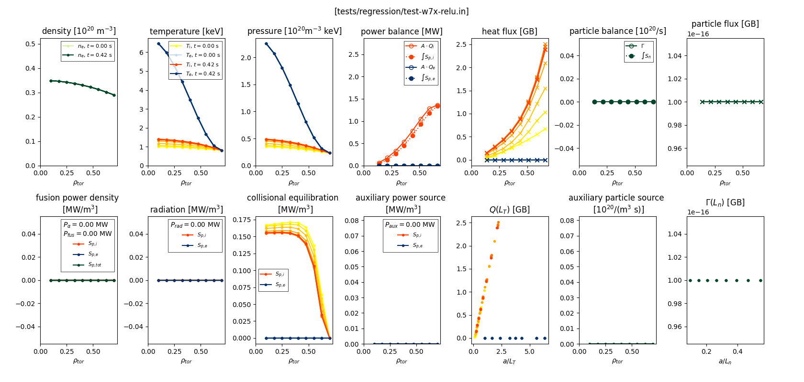

.. _quickplotting:
  
Plotting your T3D simulation results
++++++++++++++++++++++++++++++++++++

T3D data is written to a python pickle file (``.npy``), a NetCDF4 file (``.nc``), and ADIOS2 output (``.bp``). All can be used by the ``t3d-plot`` plot utility.

To create a panel summary plot of your results, use

.. code-block:: bash

  t3d-plot tests/regression/test-w7x-relu.log.npy

.. code-block:: bash

  t3d-plot tests/regression/test-w7x-relu.nc

.. code-block:: bash

  t3d-plot tests/regression/test-w7x-relu.bp

The ``t3d-plot`` utility can also be used to generate individual plots

.. code-block:: bash

  t3d-plot tests/regression/test-w7x-relu.bp -p density

Multiple-plots can be created using a space-separated list of plot names

.. code-block:: bash

  t3d-plot tests/regression/test-w7x-relu.bp -p density temperature

Use the ``-l`` option to see a list of available plot functions

.. code-block:: bash

  t3d-plot tests/regression/test-w7x-relu.bp -l
